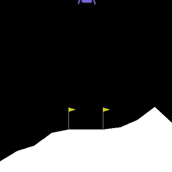
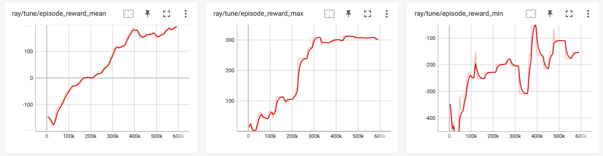

# deep-rl
This project aims to solving gym environments using RLlib: Industry-Grade Reinforcement Learning


### Get started

Ensure that your **python** version is >= 3.9 

Train the Agent using the following command:

```bash
   $ python train_rl_agent.py 
```

### Do inference after training

run the test_rl_agent script using the following command:

```bash
   $ python test_rl_agent.py 
```


### Tensorboard
```bash
   $ tensorboard --logdir=CartPole-v0_results
```


### Results 


Best Trial name                 |iter   |total time (s) |reward  | episode_reward_max  | episode_reward_min |  
:------------------------------:|:-----:|:-------------:|:------:|:-------------------:|:------------------:|
PPO_CartPole-v0_e6e3e_00000     | 28    |   145.908     | 197.08 |   200               |   127              |
PPO_LunarLander-v2_db73e_00000  | 148   |   943.732     | 195.263|   301.256           |   -153.757         | 


Emvironment                           |  Tensorboard                             
:------------------------------------:|:---------------------------------:
             | 
          | 


